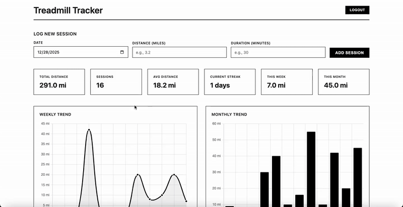

# Treadmill Tracker

A workout tracker for logging and viewing treadmill sessions.



## Tech Stack

- Node.js/Express backend
- SQLite database
- HTML/CSS/JavaScript frontend
- Chart.js for data visualization

## Setup

Install dependencies:
```bash
npm install
```

Copy `example.env` to `.env` and update the credentials:
```bash
cp example.env .env
```

Edit `.env` and change the username and password to your desired values.

Start the server:
```bash
npm start
```

The application runs on port 3000 by default.

## Database

Uses SQLite to store workout data. The database file is created automatically on first run in the `./data/` directory.
